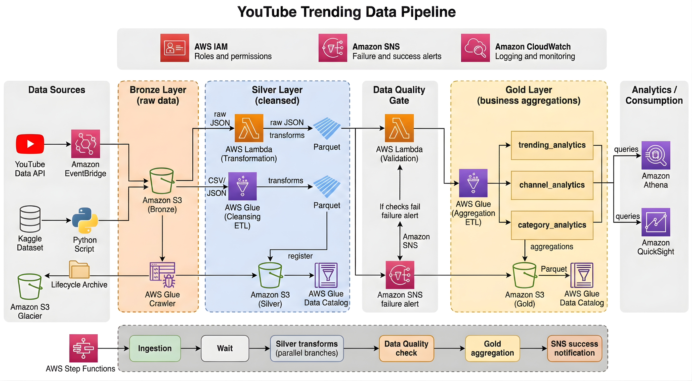
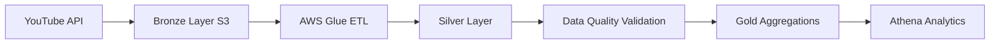

# 🎥 YouTube Data Pipeline

<div align="center">

## ⚡ Cloud-Native Medallion Data Pipeline on AWS

### AWS Glue • PySpark • Athena • Lambda • Step Functions • S3



</div>

---

# 🚀 Project Overview

A production-style cloud-native ETL pipeline that ingests YouTube trending video data across multiple regions, transforms it through a Medallion Architecture (Bronze → Silver → Gold), enforces automated data quality validations, and produces analytics-ready datasets using AWS services.

This project demonstrates:

- Scalable AWS Data Engineering
- Distributed ETL Processing
- Cloud-Native Pipeline Orchestration
- Data Lake Architecture
- Analytics Engineering
- Data Quality Frameworks
- Production Monitoring & Alerting

---

# ⚡ Key Features

✅ Multi-region YouTube API ingestion  
✅ Bronze → Silver → Gold architecture  
✅ PySpark-based ETL transformations  
✅ AWS Step Functions orchestration  
✅ Automated data quality validation  
✅ Athena analytics layer  
✅ SNS failure notifications  
✅ CloudWatch monitoring  
✅ Partitioned Parquet datasets  
✅ Analytics-ready aggregation tables  

---

# 🏗️ Architecture

## Medallion Architecture Flow



---

# ☁️ AWS Services Used

| Service | Purpose |
|---|---|
| AWS Lambda | API ingestion & validation |
| AWS Glue | Distributed ETL |
| Amazon S3 | Data Lake Storage |
| Athena | SQL analytics |
| Step Functions | Pipeline orchestration |
| SNS | Failure alerts |
| CloudWatch | Monitoring & logs |
| Glue Data Catalog | Metadata management |
| EventBridge | Scheduling |

---

# 📂 Project Structure

```bash
youtube-trending-data-pipeline/
│
├── architecture/
├── lambdas/
├── glue_jobs/
├── data_quality/
├── step_functions/
├── scripts/
└── README.md
```

---

# 🔄 Data Pipeline Flow

## Bronze Layer
- Raw YouTube API JSON data
- Historical Kaggle CSV ingestion
- Region/date partitioning

## Silver Layer
- Schema enforcement
- Null handling
- Deduplication
- Data cleansing
- Parquet conversion

## Data Quality Layer
- Row count validation
- Null percentage checks
- Schema validation
- Freshness checks
- SNS alerts on failures

## Gold Layer
Analytics-ready aggregations:
- trending_analytics
- channel_analytics
- category_analytics

---

# 📊 Example Analytics Query

```sql
SELECT channel_title, total_views
FROM yt_pipeline_gold.channel_analytics
WHERE region = 'US'
ORDER BY total_views DESC
LIMIT 10;
```

---

# ⚙️ Tech Stack

## Languages
- Python
- PySpark
- SQL

## AWS
- AWS Glue
- Amazon S3
- Athena
- Lambda
- SNS
- CloudWatch
- Step Functions

## Data Engineering
- ETL Pipelines
- Medallion Architecture
- Parquet
- Data Quality
- Partitioning

---

# 📈 Business Outcomes

✔ Reduced manual analytics workflows  
✔ Improved query performance with partitioned Parquet  
✔ Automated pipeline monitoring  
✔ Built scalable cloud-native architecture  
✔ Enabled analytics-ready reporting  

---

# 🚀 Future Enhancements

- Real-time streaming with Kafka/Kinesis
- CI/CD deployment pipeline
- Infrastructure as Code using Terraform
- dbt transformation layer
- Dockerized local development

---

# 👨‍💻 Author

## Shiva Kumar Nalabothula

AWS Data Engineer | PySpark | ETL Pipelines | Medallion Architecture

📍 Hyderabad, India

### Connect With Me

- LinkedIn: https://linkedin.com/in/shiva-kumar-nalabothula-090b021a9
- GitHub: https://github.com/ShivaKumar-DE-AWS

---

# ⭐ If You Like This Project

Give it a ⭐ on GitHub and connect with me for Data Engineering collaborations.
